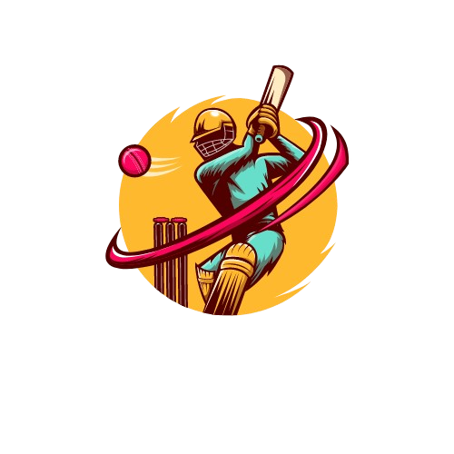
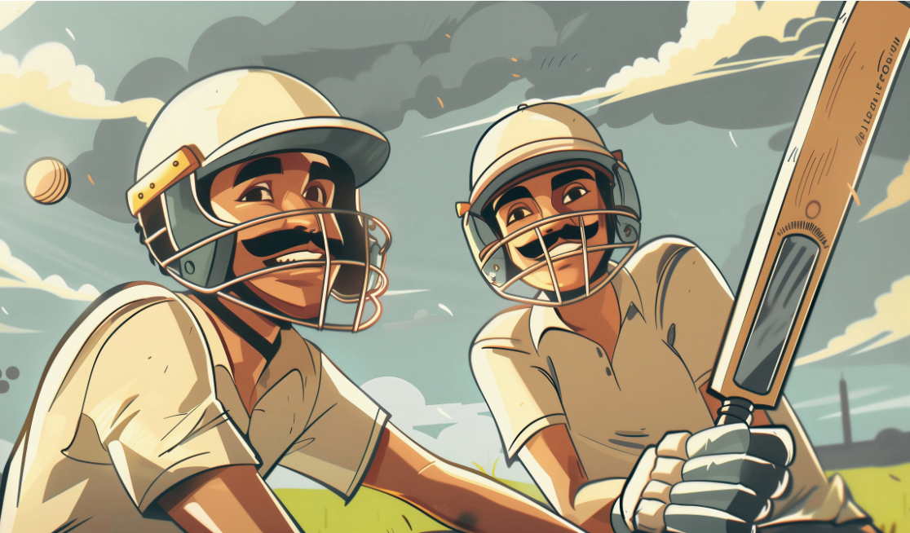
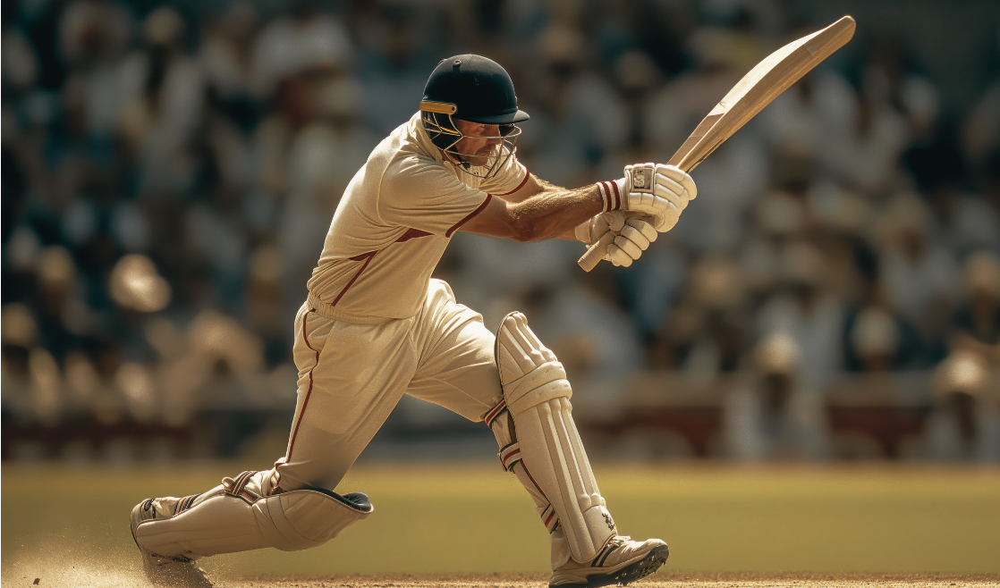

<!DOCTYPE html>
<html lang="en">
<head>
    <meta charset="UTF-8">
    <meta name="viewport" content="width=device-width, initial-scale=1.0">
    <title>XYZ Cricket Tournaments</title>
    <link href="https://fonts.googleapis.com/css2?family=Inter:wght@500;700&display=swap" rel="stylesheet">
    
</head>
<body>
    <!-- Navbar Section -->
    <nav class="navbar">
        

             <!-- Add your logo file -->
            <h1>XYZ Organization</h1>
        

        <ul>
            <li><a href="#home">Home</a></li>
            <li><a href="#about-us">About Us</a></li>
            <li><a href="#contact">Contact</a></li>
        </ul>
        <a href="login.html" class="login">Log In</a>
    </nav>

    <!-- Main Section with Video Background -->
    

        <video id="background-video" muted loop>
            <source src="https://gopani9-my.sharepoint.com/personal/st_gopani9_onmicrosoft_com/_layouts/15/download.aspx?share=EeF1GuEeoq9MgowptfBHNOwBYHyXjKgKg71LMX0UMi5Rnw" type="video/mp4">
            Your browser does not support the video tag.
        </video>
        

            
#crickettournaments

            
<h1>Welcome to the XYZ Cricket Tournaments</h1>

            

                Welcome to the ultimate destination for cricket lovers! XYZ Cricket Organization is proud to present exciting cricket tournaments where teams of all levels can come together to showcase their talent and passion for the game. Whether you're an amateur player or a seasoned pro, our tournaments are designed to bring out the best in you!
            

            <a href="login.html" class="btn">
                Sign Up
                <svg xmlns="http://www.w3.org/2000/svg" fill="none" viewBox="0 0 24 24" stroke="currentColor">
                    <path stroke-linecap="round" stroke-linejoin="round" stroke-width="2" d="M14 5l7 7m0 0l-7 7m7-7H3" />
                </svg>
            </a>
        

    

    <!-- About Us Section -->
    <section id="about-us" class="about-us" >
        <h2 class="aboutustitle">ABOUT US</h2>
        <!-- First Image on Right and Paragraph on Left -->
        

          

            

                Welcome to XYZ Sports Organization, where we are passionate about promoting the spirit of cricket through engaging tournaments that bring together players, fans, and communities. Established with a vision to enhance the experience of cricket enthusiasts, our organization focuses on creating competitive platforms for both amateur and professional players.
            

          

          

            
          

        

    
        <!-- Second Image on Left and Paragraph on Right -->
        

          

            
          

          

            

                <h2>Our Mission</h2> 
                Our mission is to organize high-quality cricket tournaments that inspire athletes and create unforgettable moments for players and spectators alike. We aim to support emerging talents by providing them with opportunities to showcase their skills on a larger stage.
            

          

        

    
        <!-- Third Image on Right and Paragraph on Left -->
        

          

            

                <h2>Exciting Tournaments</h2>Participate in a variety of tournaments tailored to different skill levels, ensuring everyone has a chance to play.  
                <h2>Professional Management</h2>Our experienced team is dedicated to organizing events that run smoothly, prioritizing player safety and enjoyment.  
                <h2>Community Engagement</h2>We actively engage with local communities to promote cricket and foster a love for the game among all age groups.
            

          

          

            
          

        

      </section>

    <!-- Contact Us Section -->
    <section id="contact">
        

            <!-- Left side: Contact details and social media links -->
            

                <h2>Contact US</h2>
                
<strong>&nbsp;&nbsp;&nbsp;&nbsp;Address:</strong> 123 Skyline Tower,US

                
<strong>&nbsp;&nbsp;&nbsp;&nbsp;Phone:</strong> +1 800 123 4567

                
<strong>&nbsp;&nbsp;&nbsp;&nbsp;Email:</strong> contact@example.com

                

                    <button class="button button1" type="button" onclick="window.location.href='https://facebook.com/xyzsportsorganization'" >Facebook</button>
                    <button class="button button2" type="button" onclick="window.location.href='https://instagram.com/xyzsportsorganization'" >Instagram</button>
                

            

    
            <!-- Right side: Contact form -->
            

                <h2>Send  us a message</h2>
                <form id="contact-form">
                    

                        <input type="text" id="name" placeholder="Your Name" required>
                    

                    

                        <input type="email" id="email" placeholder="Your Email" required>
                    

                    

                        <textarea id="message" placeholder="Your Message" required></textarea>
                    

                    <button type="submit" class="btn">Send Message</button>
                </form>
            

        

    </section>
    
</body>
</html>
